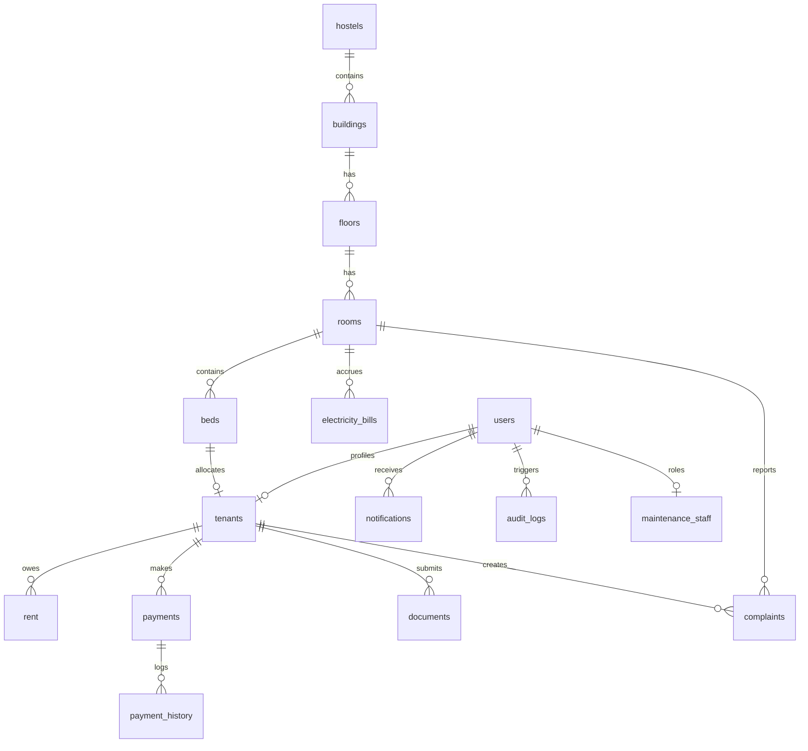

# Database Design Document: Bhagirathi Hostel & PG Management System

This document serves as the **Single Source of Truth** for the entire database architecture of the Bhagirathi Hostel & PG Management System. It contains logical systems, table layouts, data types, indexing strategies, constraints, and business logic mapping for room-based split-billing.

---

## SECTION 1: System Overview

### Business Context
The Bhagirathi Hostel & PG Management System is designed to manage hostel operations, tenant allocations, billing cycles, payments, notices, and maintenance issues. The system serves three main applications:
1. **Admin App**: Used by managers/owners to monitor hostels, manage rooms/beds, view tenants, authorize payments, split bills, and dispatch maintenance staff.
2. **Tenant App**: Used by tenants to track allocated rooms, check rent dues, pay bills (submitting UTR reference numbers and screenshots), view notices, raise complaints, and upload ID documents.
3. **Maintenance App**: Used by maintenance personnel to track, update, and resolve maintenance tickets.

### Architectural Blueprint
The system uses **FastAPI** as the backend API gateway, **Neon PostgreSQL** as the core relational database engine, and **Cloudinary** for storing all tenant images, payment confirmation screenshots, and document attachments.

```
       +------------------+     +------------------+     +-----------------------+
       |    Admin App     |     |    Tenant App    |     |    Maintenance App    |
       +--------+---------+     +--------+---------+     +-----------+-----------+
                |                        |                           |
                +-------------------+    |    +----------------------+
                                    |    |    |
                                    v    v    v
                              +----------+----------+
                              |   FastAPI Backend   |
                              +----+-----------+----+
                                   |           |
                     +-------------+           +-------------+
                     | (JSON/REST APIs)                      | (Asset Uploads/URLs)
                     v                                       v
          +----------+----------+                 +----------+----------+
          |   Neon PostgreSQL   |                 | Cloudinary Storage  |
          +---------------------+                 +---------------------+
```

### Modules & User Actors
- **Authentication**: JWT-based authentication for users (Admin, Tenant, Maintenance Staff, Owner).
- **Hostel Asset Management**: Tracks Hostels, Buildings, Floors, Rooms, and Beds.
- **Tenancy Lifecycle**: Tenant onboarding, bed allocations, check-ins, documents verification, check-outs.
- **Room-Based Billing**: Automatic equal splitting of room rents and electricity bills based on active room occupancy, with support for future custom splits.
- **Operations & Support**: Notice boards, complaints management, maintenance tracking.
- **System Logs**: Audit logs and push notifications.

---

## SECTION 2: Database Design Principles

### Normalization
The database is structured to adhere to the **Third Normal Form (3NF)**. Redundant data is eliminated by separating hostel assets (Hostels, Buildings, Floors, Rooms, Beds) and referencing them via foreign keys. Split bills are calculated dynamically or stored in separate transactional line items rather than being hardcoded inside general user profile tables.

### UUID Strategy
All tables use **Universally Unique Identifiers (UUIDv4)** for primary keys. 
- Avoids auto-increment ID enumeration security vulnerabilities.
- Simplifies cross-database syncing and replication.
- Enables safe offline ID generation on the client-side if required.

### Soft Delete Strategy
The system uses soft deletion for transactional and profiling tables to preserve referential history. Soft-deleted rows have a non-null `deleted_at` timestamp. Query filters automatically append `deleted_at IS NULL` unless explicitly requesting historic archives.

### Audit Fields
Every database table includes the following audit columns to track tracking and change logs:
- `id`: UUID (Primary Key)
- `created_at`: TIMESTAMP WITH TIME ZONE (Record creation time)
- `updated_at`: TIMESTAMP WITH TIME ZONE (Record modification time)
- `deleted_at`: TIMESTAMP WITH TIME ZONE (Soft delete timestamp, nullable)
- `created_by`: UUID (References `users.id` who generated the row, nullable)
- `updated_by`: UUID (References `users.id` who modified the row, nullable)

### Indexing Guidelines
- All foreign keys are indexed to optimize join latencies.
- High-frequency search columns (`email`, `phone`, `room_number`, `payment_status`, `created_at`) are explicitly indexed.
- Composite indexes are used where query patterns frequently combine filters (e.g., matching a tenant's billing cycle).

### Constraints
- **Foreign Keys**: Enforce referential integrity with strict cascade actions (`ON DELETE CASCADE` for parent-child relations like room-to-bed, and `ON DELETE SET NULL` for audit-related references).
- **Unique Constraints**: Used on business identifiers (e.g., UTR numbers, Aadhaar numbers, emails).
- **Check Constraints**: Prevent invalid numeric statuses (e.g., rent amounts must be $> 0$).

### Naming Conventions
- Table names are lowercase and plural (e.g., `users`, `hostels`, `electricity_bills`).
- Column names use `snake_case` (e.g., `room_number`, `billing_period`).
- Foreign key columns end with `_id` suffix (e.g., `tenant_id`, `room_id`).

### Timestamp Strategy
All timestamps use `TIMESTAMP WITH TIME ZONE` (`timestamptz`) in PostgreSQL. The system defaults to UTC for storage and relies on the client application to handle localized timezone offsets.

---

## SECTION 3: Complete Module List

1. **Authentication**: Manages `users`, `user_tokens`, and `password_reset_tokens`. Tracks user roles (ADMIN, TENANT, MAINTENANCE, OWNER).
2. **Hostels**: Represents physical PG/Hostel campuses.
3. **Buildings**: Physical blocks or wings inside a hostel.
4. **Floors**: Distinct floor numbers belonging to a building.
5. **Rooms**: The billing base unit. Stores capacity, standard rent, and split configurations.
6. **Beds**: Discrete units of occupancy within a room.
7. **Tenants**: Holds detailed tenant profiles, emergency contacts, status, and bed allocations.
8. **Maintenance**: Tracks registered maintenance workers and their specialties.
9. **Room Allocation**: Connects tenants to specific beds inside a room.
10. **Rent**: Tracks monthly base rent invoices generated for rooms, along with split tenant balances.
11. **Electricity**: Represents monthly electricity meter entries, bills, and splits.
12. **Payments**: Records payments submitted by tenants with UTR reference codes and Cloudinary image receipts.
13. **Complaints**: Tracks maintenance requests, categories, assignees, and resolution statuses.
14. **Documents**: Verified tenant ID certificates stored on Cloudinary.
15. **Notices**: Multi-audience broadcast bulletins.
16. **Notifications**: Tracks transactional push alerts and read status.
17. **Reports**: System summary metrics (virtual table mapping).
18. **Audit Logs**: Raw changes tracking who updated what database row and what value was changed.
19. **Settings**: Configurable variables (e.g., payment UPI addresses, late fees, system-wide variables).

---

## SECTION 4: Complete Table List

### 1. `users`
- **Purpose**: Central authorization record containing credentials, name, and roles.
- **Primary Key**: `id` (UUID)
- **Relationships**:
  - One-to-Many with `user_tokens`
  - One-to-Many with `password_reset_tokens`
- **Indexes**: `idx_users_email` (Unique), `idx_users_phone` (Unique)
- **Constraints**: Email and Phone must be unique. Password hash cannot be null.

### 2. `hostels`
- **Purpose**: Physical PG campuses.
- **Primary Key**: `id` (UUID)
- **Relationships**:
  - One-to-Many with `buildings`
- **Indexes**: `idx_hostels_name` (Unique)
- **Constraints**: Name must be unique and non-null.

### 3. `buildings`
- **Purpose**: Blocks within host campuses.
- **Primary Key**: `id` (UUID)
- **Relationships**:
  - Many-to-One with `hostels` (FK `hostel_id`)
  - One-to-Many with `floors`
- **Indexes**: `idx_buildings_hostel_id`, `idx_buildings_name`
- **Constraints**: Composite unique constraint on `(hostel_id, name)`.

### 4. `floors`
- **Purpose**: Floors inside buildings.
- **Primary Key**: `id` (UUID)
- **Relationships**:
  - Many-to-One with `buildings` (FK `building_id`)
  - One-to-Many with `rooms`
- **Indexes**: `idx_floors_building_id`
- **Constraints**: Composite unique constraint on `(building_id, floor_number)`.

### 5. `rooms`
- **Purpose**: Primary billing and capacity unit. Holds monthly base rent.
- **Primary Key**: `id` (UUID)
- **Relationships**:
  - Many-to-One with `floors` (FK `floor_id`)
  - One-to-Many with `beds`
- **Indexes**: `idx_rooms_floor_id`, `idx_rooms_room_number`
- **Constraints**: Room number must be non-null and indexed. Monthly rent must be $> 0$.

### 6. `beds`
- **Purpose**: Specific beds within a room.
- **Primary Key**: `id` (UUID)
- **Relationships**:
  - Many-to-One with `rooms` (FK `room_id`)
  - One-to-One with `tenants` (FK on tenant)
- **Indexes**: `idx_beds_room_id`, `idx_beds_bed_number`
- **Constraints**: Composite unique constraint on `(room_id, bed_number)`.

### 7. `tenants`
- **Purpose**: Tenant profile, emergency contacts, and linked active bed.
- **Primary Key**: `id` (UUID)
- **Relationships**:
  - Many-to-One with `users` (FK `user_id`, optional)
  - Many-to-One with `beds` (FK `bed_id`, optional)
  - One-to-Many with `rent` line items
  - One-to-Many with `payments`
  - One-to-Many with `documents`
- **Indexes**: `idx_tenants_phone` (Unique), `idx_tenants_email` (Unique), `idx_tenants_bed_id`
- **Constraints**: Tenant must have a valid phone and email. Phone and Aadhaar number must be unique.

### 8. `maintenance_staff`
- **Purpose**: Registers maintenance employees.
- **Primary Key**: `id` (UUID)
- **Relationships**:
  - Many-to-One with `users` (FK `user_id`)
  - One-to-Many with `complaints`
- **Indexes**: `idx_maintenance_staff_user_id`
- **Constraints**: Non-null user link.

### 9. `rent`
- **Purpose**: Monthly rent split instances generated for tenants.
- **Primary Key**: `id` (UUID)
- **Relationships**:
  - Many-to-One with `tenants` (FK `tenant_id`)
  - Many-to-One with `rooms` (FK `room_id`)
- **Indexes**: `idx_rent_tenant_id`, `idx_rent_room_id`, `idx_rent_status`
- **Constraints**: Rent amount must be $> 0$. Due date must be after generation date.

### 10. `electricity_bills`
- **Purpose**: Tracks room-level meter readings and split shares.
- **Primary Key**: `id` (UUID)
- **Relationships**:
  - Many-to-One with `rooms` (FK `room_id`)
- **Indexes**: `idx_electricity_bills_room_id`, `idx_electricity_bills_status`
- **Constraints**: `meter_reading_after` must be $\ge$ `meter_reading_before`. Total amount must be $\ge 0$.

### 11. `payments`
- **Purpose**: Records transaction logs submitted by tenants.
- **Primary Key**: `id` (UUID)
- **Relationships**:
  - Many-to-One with `tenants` (FK `tenant_id`)
- **Indexes**: `idx_payments_tenant_id`, `idx_payments_payment_status` (index on `status`), `idx_payments_utr` (Unique)
- **Constraints**: Unique UTR number constraint. Amount paid must be $> 0$.

### 12. `complaints`
- **Purpose**: Tickets for maintenance issues.
- **Primary Key**: `id` (UUID)
- **Relationships**:
  - Many-to-One with `tenants` (FK `tenant_id`)
  - Many-to-One with `rooms` (FK `room_id`, nullable)
  - Many-to-One with `maintenance_staff` (FK `assigned_to`, nullable)
- **Indexes**: `idx_complaints_tenant_id`, `idx_complaints_status`
- **Constraints**: Title and description must be non-empty.

### 13. `notices`
- **Purpose**: Broadcast board.
- **Primary Key**: `id` (UUID)
- **Relationships**: None (Broadcast-oriented).
- **Indexes**: `idx_notices_created_at`
- **Constraints**: Title and content cannot be null.

### 14. `documents`
- **Purpose**: Tracks Cloudinary PDF/Image links for verification.
- **Primary Key**: `id` (UUID)
- **Relationships**:
  - Many-to-One with `tenants` (FK `tenant_id`)
- **Indexes**: `idx_documents_tenant_id`, `idx_documents_status`
- **Constraints**: Non-empty document URL.

### 15. `payment_history`
- **Purpose**: Audit timeline tracking changes to payment statuses.
- **Primary Key**: `id` (UUID)
- **Relationships**:
  - Many-to-One with `tenants` (FK `tenant_id`)
  - Many-to-One with `payments` (FK `payment_id`)
- **Indexes**: `idx_payment_history_tenant_id`, `idx_payment_history_payment_id`
- **Constraints**: Status update transitions must be verified.

### 16. `notifications`
- **Purpose**: Push notification logs.
- **Primary Key**: `id` (UUID)
- **Relationships**:
  - Many-to-One with `users` (FK `user_id`)
- **Indexes**: `idx_notifications_user_id`, `idx_notifications_created_at`
- **Constraints**: Message body cannot be null.

### 17. `audit_logs`
- **Purpose**: Global record of row-level actions.
- **Primary Key**: `id` (UUID)
- **Relationships**:
  - Many-to-One with `users` (FK `user_id`, nullable)
- **Indexes**: `idx_audit_logs_user_id`, `idx_audit_logs_created_at`
- **Constraints**: Action description and target table name must be present.

### 18. `settings`
- **Purpose**: Key-value system configurations.
- **Primary Key**: `id` (UUID)
- **Relationships**:
  - Many-to-One with `hostels` (FK `hostel_id`, nullable)
- **Indexes**: `idx_settings_hostel_id`, `idx_settings_key` (Unique key within hostel)
- **Constraints**: Key must be non-null.

---

## SECTION 5: ER Diagram

The logical relationship hierarchy follows a cascading pattern from the Hostel properties down to Room Occupancy, which drives the Billing and Support systems.



---

## SECTION 6: Relationship Documentation

### One-to-Many / Many-to-One Relations
- **Hostel $\rightarrow$ Building (1:N)**: A hostel campus spans multiple buildings or blocks. If a hostel is soft-deleted, all buildings inside it are soft-deleted or cascades down.
- **Building $\rightarrow$ Floor (1:N)**: A building consists of multiple floors. Each floor belongs to one building.
- **Floor $\rightarrow$ Room (1:N)**: A floor holds many rooms. Rooms are mapped to a specific floor to clarify location coordinates.
- **Room $\rightarrow$ Bed (1:N)**: A room contains multiple beds (e.g., single share, double share). This controls occupancy capacity.
- **Room $\rightarrow$ Electricity Bill (1:N)**: Electricity bills are recorded per room since meters are installed per room.
- **Tenant $\rightarrow$ Rent (1:N)**: A tenant receives a distinct rent split record every billing month.
- **Tenant $\rightarrow$ Payments (1:N)**: A tenant makes payments over time. Each payment transaction is associated with one tenant profile.
- **Tenant $\rightarrow$ Documents (1:N)**: A tenant can upload multiple identification documents (e.g. Aadhaar Front, Aadhaar Back, Agreement Paper).
- **Tenant $\rightarrow$ Complaints (1:N)**: A tenant raises complaints about rooms or facilities.
- **Payments $\rightarrow$ Payment History (1:N)**: Tracks payment approval state history (e.g. Pending Verification $\rightarrow$ Under Review $\rightarrow$ Approved).

### One-to-One Relations
- **User $\rightarrow$ Tenant (1:1)**: Link between credentials and tenant personal profiles. An administrator user does not have a tenant record.
- **User $\rightarrow$ Maintenance Staff (1:1)**: Link between system credentials and maintenance personnel.
- **Bed $\rightarrow$ Tenant (1:1 / 1:0)**: A bed is allocated to at most one active tenant. A tenant occupies at most one bed at a time.

### Many-to-Many Relations
- **Complaint $\rightarrow$ Maintenance Staff**: Modeled using a middle table `complaints` where `assigned_to` links to a specific maintenance worker, while history or assignments (using a helper table `complaint_assignments`) can track multi-agent ticket delegation.

---

## SECTION 7: Column Definitions

Here are the detailed table fields, types, default variables, and validation rules.

### 1. Table `users`
| Column Name | PostgreSQL Data Type | Nullable | Default Value | Validation Rules |
| :--- | :--- | :--- | :--- | :--- |
| `id` | UUID | No | `gen_random_uuid()` | Must be a valid UUIDv4. |
| `email` | VARCHAR(255) | No | None | Regex check for valid email format. |
| `phone` | VARCHAR(20) | Yes | NULL | Minimum 10 digits if provided. |
| `full_name` | VARCHAR(100) | No | None | Cannot be empty or whitespace. |
| `password_hash` | VARCHAR(255) | No | None | Standard bcrypt verification hash. |
| `role` | VARCHAR(20) | No | `'TENANT'` | In `('ADMIN', 'TENANT', 'MAINTENANCE', 'OWNER')`. |
| `is_active` | BOOLEAN | No | `TRUE` | Boolean flag. |
| `is_superuser` | BOOLEAN | No | `FALSE` | Boolean flag. |
| `profile_photo` | VARCHAR(512) | Yes | NULL | Must be a secure Cloudinary URL. |
| `last_login` | TIMESTAMPTZ | Yes | NULL | Must be a valid timestamp. |
| `created_at` | TIMESTAMPTZ | No | `NOW()` | Automatically set. |
| `updated_at` | TIMESTAMPTZ | No | `NOW()` | Updates on modification. |
| `deleted_at` | TIMESTAMPTZ | Yes | NULL | Null if active. |
| `created_by` | UUID | Yes | NULL | Must match an existing user ID. |
| `updated_by` | UUID | Yes | NULL | Must match an existing user ID. |

### 2. Table `hostels`
| Column Name | PostgreSQL Data Type | Nullable | Default Value | Validation Rules |
| :--- | :--- | :--- | :--- | :--- |
| `id` | UUID | No | `gen_random_uuid()` | Valid UUIDv4. |
| `name` | VARCHAR(100) | No | None | Unique string, cannot be blank. |
| `address` | VARCHAR(500) | Yes | NULL | None. |
| `type` | VARCHAR(20) | No | `'COED'` | In `('BOYS', 'GIRLS', 'COED')`. |
| `is_active` | BOOLEAN | No | `TRUE` | Boolean flag. |
| `created_at` / `updated_at` | TIMESTAMPTZ | No | `NOW()` | Standard audit fields. |
| `deleted_at` | TIMESTAMPTZ | Yes | NULL | Standard audit fields. |

### 3. Table `buildings`
| Column Name | PostgreSQL Data Type | Nullable | Default Value | Validation Rules |
| :--- | :--- | :--- | :--- | :--- |
| `id` | UUID | No | `gen_random_uuid()` | Valid UUIDv4. |
| `hostel_id` | UUID | No | None | Foreign key referencing `hostels.id`. |
| `name` | VARCHAR(100) | No | None | Unique per hostel. |
| `code` | VARCHAR(10) | Yes | NULL | Short code (e.g. "A-BLOCK"). |
| `is_active` | BOOLEAN | No | `TRUE` | Boolean flag. |
| `created_at` / `updated_at` | TIMESTAMPTZ | No | `NOW()` | Standard audit fields. |
| `deleted_at` | TIMESTAMPTZ | Yes | NULL | Standard audit fields. |

### 4. Table `floors`
| Column Name | PostgreSQL Data Type | Nullable | Default Value | Validation Rules |
| :--- | :--- | :--- | :--- | :--- |
| `id` | UUID | No | `gen_random_uuid()` | Valid UUIDv4. |
| `building_id` | UUID | No | None | Foreign key referencing `buildings.id`. |
| `floor_number` | INTEGER | No | None | Must be $\ge 0$ (0 = Ground Floor). |
| `name` | VARCHAR(50) | No | None | e.g., "1st Floor". |
| `is_active` | BOOLEAN | No | `TRUE` | Boolean flag. |
| `created_at` / `updated_at` | TIMESTAMPTZ | No | `NOW()` | Standard audit fields. |
| `deleted_at` | TIMESTAMPTZ | Yes | NULL | Standard audit fields. |

### 5. Table `rooms`
| Column Name | PostgreSQL Data Type | Nullable | Default Value | Validation Rules |
| :--- | :--- | :--- | :--- | :--- |
| `id` | UUID | No | `gen_random_uuid()` | Valid UUIDv4. |
| `floor_id` | UUID | No | None | Foreign key referencing `floors.id`. |
| `room_number` | VARCHAR(50) | No | None | Must be unique per building. |
| `room_type` | VARCHAR(30) | No | `'DOUBLE_SHARE'` | e.g. Single, Double, Triple. |
| `capacity` | INTEGER | No | `2` | Must be $\ge 1$. |
| `monthly_rent` | NUMERIC(10,2) | No | None | Must be $> 0$. |
| `rent_split_type` | VARCHAR(20) | No | `'equal'` | In `('equal', 'custom')`. |
| `status` | VARCHAR(20) | No | `'AVAILABLE'` | In `('AVAILABLE', 'OCCUPIED', 'MAINTENANCE')`. |
| `is_active` | BOOLEAN | No | `TRUE` | Boolean flag. |
| `created_at` / `updated_at` | TIMESTAMPTZ | No | `NOW()` | Standard audit fields. |
| `deleted_at` | TIMESTAMPTZ | Yes | NULL | Standard audit fields. |

### 6. Table `beds`
| Column Name | PostgreSQL Data Type | Nullable | Default Value | Validation Rules |
| :--- | :--- | :--- | :--- | :--- |
| `id` | UUID | No | `gen_random_uuid()` | Valid UUIDv4. |
| `room_id` | UUID | No | None | Foreign key referencing `rooms.id`. |
| `bed_number` | VARCHAR(20) | No | None | e.g., "A", "B". Unique per room. |
| `bed_status` | VARCHAR(20) | No | `'AVAILABLE'` | In `('AVAILABLE', 'MAINTENANCE')`. |
| `occupancy_status` | VARCHAR(20) | No | `'VACANT'` | In `('VACANT', 'OCCUPIED')`. |
| `is_active` | BOOLEAN | No | `TRUE` | Boolean flag. |
| `created_at` / `updated_at` | TIMESTAMPTZ | No | `NOW()` | Standard audit fields. |
| `deleted_at` | TIMESTAMPTZ | Yes | NULL | Standard audit fields. |

### 7. Table `tenants`
| Column Name | PostgreSQL Data Type | Nullable | Default Value | Validation Rules |
| :--- | :--- | :--- | :--- | :--- |
| `id` | UUID | No | `gen_random_uuid()` | Valid UUIDv4. |
| `user_id` | UUID | Yes | NULL | References `users.id` (one-to-one). |
| `bed_id` | UUID | Yes | NULL | References `beds.id`. |
| `hostel_id` | UUID | Yes | NULL | References `hostels.id`. |
| `room_id` | UUID | Yes | NULL | References `rooms.id`. |
| `full_name` | VARCHAR(100) | No | None | Plain string, non-null. |
| `phone` | VARCHAR(20) | No | None | Unique phone number. |
| `email` | VARCHAR(255) | No | None | Unique email. |
| `photo_url` | VARCHAR(512) | Yes | NULL | Must be a secure Cloudinary URL. |
| `gender` | VARCHAR(15) | Yes | NULL | e.g., MALE, FEMALE. |
| `dob` | DATE | Yes | NULL | Must be in the past. |
| `aadhaar_number` | VARCHAR(20) | Yes | NULL | Must be exactly 12 digits or match regional ID. |
| `guardian_name` | VARCHAR(100) | Yes | NULL | Text. |
| `guardian_phone` | VARCHAR(20) | Yes | NULL | Phone validation. |
| `emergency_contact` | VARCHAR(20) | Yes | NULL | Phone validation. |
| `permanent_address` | VARCHAR(500) | Yes | NULL | Text. |
| `current_address` | VARCHAR(500) | Yes | NULL | Text. |
| `occupation` | VARCHAR(100) | Yes | NULL | e.g. Student, Professional. |
| `blood_group` | VARCHAR(5) | Yes | NULL | Valid blood group format. |
| `joining_date` | DATE | Yes | NULL | Date format. |
| `status` | VARCHAR(20) | No | `'ACTIVE'` | In `('ACTIVE', 'INACTIVE', 'CHECKED_OUT')`. |
| `is_active` | BOOLEAN | No | `TRUE` | Boolean flag. |
| `created_at` / `updated_at` | TIMESTAMPTZ | No | `NOW()` | Standard audit fields. |
| `deleted_at` | TIMESTAMPTZ | Yes | NULL | Standard audit fields. |

### 8. Table `maintenance_staff`
| Column Name | PostgreSQL Data Type | Nullable | Default Value | Validation Rules |
| :--- | :--- | :--- | :--- | :--- |
| `id` | UUID | No | `gen_random_uuid()` | Valid UUIDv4. |
| `user_id` | UUID | No | None | References `users.id`. |
| `specialty` | VARCHAR(50) | No | None | In `('PLUMBING', 'ELECTRICAL', 'CLEANING', 'GENERAL')`. |
| `status` | VARCHAR(20) | No | `'ACTIVE'` | In `('ACTIVE', 'INACTIVE', 'BUSY')`. |
| `created_at` / `updated_at` | TIMESTAMPTZ | No | `NOW()` | Standard audit fields. |
| `deleted_at` | TIMESTAMPTZ | Yes | NULL | Standard audit fields. |

### 9. Table `rent`
| Column Name | PostgreSQL Data Type | Nullable | Default Value | Validation Rules |
| :--- | :--- | :--- | :--- | :--- |
| `id` | UUID | No | `gen_random_uuid()` | Valid UUIDv4. |
| `tenant_id` | UUID | No | None | References `tenants.id`. |
| `room_id` | UUID | No | None | References `rooms.id`. |
| `amount` | NUMERIC(10,2) | No | None | Must be $> 0$. |
| `due_date` | DATE | No | None | Valid date. |
| `status` | VARCHAR(20) | No | `'PENDING'` | In `('PENDING', 'PAID', 'OVERDUE')`. |
| `created_at` / `updated_at` | TIMESTAMPTZ | No | `NOW()` | Standard audit fields. |
| `deleted_at` | TIMESTAMPTZ | Yes | NULL | Standard audit fields. |

### 10. Table `electricity_bills`
| Column Name | PostgreSQL Data Type | Nullable | Default Value | Validation Rules |
| :--- | :--- | :--- | :--- | :--- |
| `id` | UUID | No | `gen_random_uuid()` | Valid UUIDv4. |
| `room_id` | UUID | No | None | References `rooms.id`. |
| `bill_amount` | NUMERIC(10,2) | No | None | Must be $\ge 0$. |
| `billing_period` | VARCHAR(50) | No | None | Format e.g., "YYYY-MM". |
| `status` | VARCHAR(20) | No | `'PENDING'` | In `('PENDING', 'PAID', 'OVERDUE')`. |
| `meter_reading_before`| NUMERIC(10,2) | No | None | Must be $\ge 0$. |
| `meter_reading_after` | NUMERIC(10,2) | No | None | Must be $\ge$ `meter_reading_before`. |
| `meter_image_url` | VARCHAR(512) | Yes | NULL | Cloudinary photo proof URL. |
| `created_at` / `updated_at` | TIMESTAMPTZ | No | `NOW()` | Standard audit fields. |
| `deleted_at` | TIMESTAMPTZ | Yes | NULL | Standard audit fields. |

### 11. Table `payments`
| Column Name | PostgreSQL Data Type | Nullable | Default Value | Validation Rules |
| :--- | :--- | :--- | :--- | :--- |
| `id` | UUID | No | `gen_random_uuid()` | Valid UUIDv4. |
| `tenant_id` | UUID | No | None | References `tenants.id`. |
| `amount` | NUMERIC(10,2) | No | None | Must be $> 0$. |
| `payment_date` | DATE | No | None | Must not be in the future. |
| `payment_method` | VARCHAR(30) | No | `'UPI'` | In `('UPI', 'CASH', 'CARD', 'BANK_TRANSFER')`. |
| `payment_status` | VARCHAR(20) | No | `'PENDING'` | In `('PENDING', 'VERIFIED', 'REJECTED')`. |
| `transaction_id` | VARCHAR(100) | Yes | NULL | Also known as UTR. Must be unique. |
| `proof_image_url` | VARCHAR(512) | Yes | NULL | Must be a secure Cloudinary URL. |
| `created_at` / `updated_at` | TIMESTAMPTZ | No | `NOW()` | Standard audit fields. |
| `deleted_at` | TIMESTAMPTZ | Yes | NULL | Standard audit fields. |

### 12. Table `complaints`
| Column Name | PostgreSQL Data Type | Nullable | Default Value | Validation Rules |
| :--- | :--- | :--- | :--- | :--- |
| `id` | UUID | No | `gen_random_uuid()` | Valid UUIDv4. |
| `tenant_id` | UUID | No | None | References `tenants.id`. |
| `room_id` | UUID | Yes | NULL | References `rooms.id`. |
| `assigned_to` | UUID | Yes | NULL | References `maintenance_staff.id`. |
| `title` | VARCHAR(150) | No | None | Text, cannot be empty. |
| `description` | TEXT | No | None | Text description. |
| `category` | VARCHAR(50) | No | None | In `('Plumbing', 'Electrical', 'Cleaning', 'Internet', 'Furniture', 'Other')`. |
| `status` | VARCHAR(20) | No | `'OPEN'` | In `('OPEN', 'IN_PROGRESS', 'RESOLVED', 'CLOSED')`. |
| `severity` | VARCHAR(20) | No | `'MEDIUM'` | In `('LOW', 'MEDIUM', 'HIGH', 'CRITICAL')`. |
| `resolution_notes` | TEXT | Yes | NULL | Output notes. |
| `created_at` / `updated_at` | TIMESTAMPTZ | No | `NOW()` | Standard audit fields. |
| `deleted_at` | TIMESTAMPTZ | Yes | NULL | Standard audit fields. |

### 13. Table `complaint_images`
| Column Name | PostgreSQL Data Type | Nullable | Default Value | Validation Rules |
| :--- | :--- | :--- | :--- | :--- |
| `id` | UUID | No | `gen_random_uuid()` | Valid UUIDv4. |
| `complaint_id` | UUID | No | None | References `complaints.id` (cascade). |
| `image_path` | VARCHAR(512) | No | None | Cloudinary URL. |
| `created_at` / `updated_at` | TIMESTAMPTZ | No | `NOW()` | Standard audit fields. |

### 14. Table `complaint_assignments`
| Column Name | PostgreSQL Data Type | Nullable | Default Value | Validation Rules |
| :--- | :--- | :--- | :--- | :--- |
| `id` | UUID | No | `gen_random_uuid()` | Valid UUIDv4. |
| `complaint_id` | UUID | No | None | References `complaints.id` (cascade). |
| `maintenance_staff_id`| UUID | No | None | References `maintenance_staff.id`. |
| `created_at` / `updated_at` | TIMESTAMPTZ | No | `NOW()` | Standard audit fields. |

### 15. Table `notices`
| Column Name | PostgreSQL Data Type | Nullable | Default Value | Validation Rules |
| :--- | :--- | :--- | :--- | :--- |
| `id` | UUID | No | `gen_random_uuid()` | Valid UUIDv4. |
| `title` | VARCHAR(200) | No | None | Cannot be empty. |
| `content` | TEXT | No | None | Text body. |
| `target_audience` | VARCHAR(50) | No | `'ALL'` | Target segment e.g., "ALL", or a specific Hostel UUID. |
| `is_pinned` | BOOLEAN | No | `FALSE` | Pin order. |
| `image_url` | VARCHAR(512) | Yes | NULL | Cloudinary photo attachment. |
| `created_at` / `updated_at` | TIMESTAMPTZ | No | `NOW()` | Standard audit fields. |
| `deleted_at` | TIMESTAMPTZ | Yes | NULL | Standard audit fields. |

### 16. Table `documents`
| Column Name | PostgreSQL Data Type | Nullable | Default Value | Validation Rules |
| :--- | :--- | :--- | :--- | :--- |
| `id` | UUID | No | `gen_random_uuid()` | Valid UUIDv4. |
| `tenant_id` | UUID | No | None | References `tenants.id` (cascade). |
| `document_type` | VARCHAR(50) | No | None | In `('AADHAAR_FRONT', 'AADHAAR_BACK', 'PAN', 'AGREEMENT', 'OTHER')`. |
| `document_url` | VARCHAR(512) | No | None | Cloudinary URL. |
| `status` | VARCHAR(20) | No | `'PENDING'` | In `('PENDING', 'VERIFIED', 'REJECTED')`. |
| `created_at` / `updated_at` | TIMESTAMPTZ | No | `NOW()` | Standard audit fields. |
| `deleted_at` | TIMESTAMPTZ | Yes | NULL | Standard audit fields. |

### 17. Table `payment_history`
| Column Name | PostgreSQL Data Type | Nullable | Default Value | Validation Rules |
| :--- | :--- | :--- | :--- | :--- |
| `id` | UUID | No | `gen_random_uuid()` | Valid UUIDv4. |
| `tenant_id` | UUID | No | None | References `tenants.id`. |
| `payment_id` | UUID | Yes | NULL | References `payments.id`. |
| `action` | VARCHAR(50) | No | None | e.g. "STATUS_CHANGE", "REMARKS_ADDED". |
| `details` | VARCHAR(255) | Yes | NULL | Descriptions. |
| `created_at` / `updated_at` | TIMESTAMPTZ | No | `NOW()` | Standard audit fields. |
| `deleted_at` | TIMESTAMPTZ | Yes | NULL | Standard audit fields. |

### 18. Table `notifications`
| Column Name | PostgreSQL Data Type | Nullable | Default Value | Validation Rules |
| :--- | :--- | :--- | :--- | :--- |
| `id` | UUID | No | `gen_random_uuid()` | Valid UUIDv4. |
| `user_id` | UUID | No | None | References `users.id` (cascade). |
| `title` | VARCHAR(150) | No | None | Notification title. |
| `message` | TEXT | No | None | Main body. |
| `notification_type` | VARCHAR(30) | No | `'SYSTEM'` | e.g., SYSTEM, DUES, COMPLAINT. |
| `is_read` | BOOLEAN | No | `FALSE` | Read flag. |
| `read_at` | TIMESTAMPTZ | Yes | NULL | Must be after creation time. |
| `created_at` / `updated_at` | TIMESTAMPTZ | No | `NOW()` | Standard audit fields. |

### 19. Table `audit_logs`
| Column Name | PostgreSQL Data Type | Nullable | Default Value | Validation Rules |
| :--- | :--- | :--- | :--- | :--- |
| `id` | UUID | No | `gen_random_uuid()` | Valid UUIDv4. |
| `user_id` | UUID | Yes | NULL | References `users.id`. Null if system trigger. |
| `action` | VARCHAR(50) | No | None | e.g., CREATE, UPDATE, DELETE, LOGIN. |
| `table_name` | VARCHAR(100) | No | None | Target database table. |
| `record_id` | UUID | Yes | NULL | Target row ID. |
| `old_values` | TEXT | Yes | NULL | Wiped values JSON dump. |
| `new_values` | TEXT | Yes | NULL | New inputs JSON dump. |
| `ip_address` | VARCHAR(45) | Yes | NULL | Supports IPv4/IPv6 length. |
| `user_agent` | VARCHAR(512) | Yes | NULL | Browser/OS info. |
| `created_at` | TIMESTAMPTZ | No | `NOW()` | Standard timestamp. |

### 20. Table `settings`
| Column Name | PostgreSQL Data Type | Nullable | Default Value | Validation Rules |
| :--- | :--- | :--- | :--- | :--- |
| `id` | UUID | No | `gen_random_uuid()` | Valid UUIDv4. |
| `hostel_id` | UUID | Yes | NULL | References `hostels.id` (null if global setting). |
| `key` | VARCHAR(100) | No | None | Text, unique identifier. |
| `value` | TEXT | No | None | Configuration value payload. |
| `description` | VARCHAR(255) | Yes | NULL | Short detail text. |
| `created_at` / `updated_at` | TIMESTAMPTZ | No | `NOW()` | Standard audit fields. |
| `deleted_at` | TIMESTAMPTZ | Yes | NULL | Standard audit fields. |

---

## SECTION 8: Indexes

To ensure fast query responses even at scale, we use the following indexing strategy:

| Index Name | Table Name | Columns | Index Type | Business Rationale |
| :--- | :--- | :--- | :--- | :--- |
| `uq_users_email` | `users` | `email` | B-Tree (Unique) | Accelerates login checks. |
| `uq_users_phone` | `users` | `phone` | B-Tree (Unique) | Optimizes alternative logins. |
| `idx_tenants_phone` | `tenants` | `phone` | B-Tree (Unique) | Quick tenant profile lookup. |
| `idx_tenants_email` | `tenants` | `email` | B-Tree (Unique) | Direct email-based queries. |
| `idx_rooms_room_number`| `rooms` | `room_number` | B-Tree | Speeds up searching rooms. |
| `idx_payments_status` | `payments` | `payment_status` | B-Tree | Filters pending payments for admin dashboard. |
| `idx_complaints_status`| `complaints` | `status` | B-Tree | Accelerates ticket dashboard categorization. |
| `idx_audit_logs_date` | `audit_logs` | `created_at` | B-Tree (Desc) | Speeds up chronological sorting of audit trails. |
| `idx_rent_tenant_id` | `rent` | `tenant_id` | B-Tree | Fetching outstanding bills for a specific tenant. |
| `idx_payments_tenant_id`| `payments` | `tenant_id` | B-Tree | Fetching historic ledger transactions. |
| `idx_settings_hostel` | `settings` | `hostel_id` | B-Tree | Optimizes loading PG-specific properties. |

### Rationale for Indexes
1. **Unique Constraints**: Automatically creates a unique B-Tree index in PostgreSQL, verifying that duplicate values (like emails or UTR codes) cannot exist.
2. **Foreign Keys**: B-Tree indexes on foreign keys prevent slow sequential table scans during joins (e.g. joining `rooms` to `floors`).
3. **Status Fields**: Dashboard statistics frequently filter rows by status (e.g., matching outstanding payments or open complaints). Indexing these fields speeds up dashboard queries.
4. **Chronological Sorting**: Transactions, notifications, and logs are sorted by `created_at` in descending order. Reverse indexes (`DESC`) optimize these queries.

---

## SECTION 9: Constraints

### Primary and Foreign Keys
- All PKs are marked as `PRIMARY KEY` (backed by UUID B-Tree index).
- Foreign key dependencies use strict actions:
  - `ON DELETE CASCADE` is applied to pure child entities (e.g. deleting a `room` drops all child `beds` and `electricity_bills`).
  - `ON DELETE SET NULL` is applied to audit fields and profile linkages (e.g., if a user is deleted, the `created_by` or `assigned_to` reference becomes `NULL` to keep historical data intact).

### Unique Constraints
- `uq_users_email` on `users(email)`
- `uq_tenants_phone` on `tenants(phone)`
- `uq_tenants_aadhaar` on `tenants(aadhaar_number)`
- `uq_payments_utr` on `payments(transaction_id)`
- `uq_hostel_building_name` on `buildings(hostel_id, name)`
- `uq_building_floor_number` on `floors(building_id, floor_number)`
- `uq_floor_room_number` on `rooms(floor_id, room_number)`
- `uq_room_bed_number` on `beds(room_id, bed_number)`

### Check Constraints
- `chk_rooms_rent`: `rooms(monthly_rent > 0)`
- `chk_rooms_capacity`: `rooms(capacity >= 1)`
- `chk_rent_amount`: `rent(amount > 0)`
- `chk_electricity_reading`: `electricity_bills(meter_reading_after >= meter_reading_before)`
- `chk_payments_amount`: `payments(amount > 0)`

---

## SECTION 10: Room-Based Billing Design

The system implements a **Room-Based Billing Architecture**, where the room itself is the primary source of rent.

### Auto-Split Logic
Instead of billing tenants a fixed rate individually, rent is calculated per room. 
If the configuration set on a room is `rent_split_type = 'equal'`, the system calculates the split dynamically.

Let $R_m$ be the base monthly rent of a room, and $N_a$ be the number of active occupants (tenants occupying a bed in that room with `status = 'ACTIVE'`) on the billing generation date. 
The system calculates the individual tenant share ($S_t$) as:

$$S_t = \frac{R_m}{N_a}$$

```
                +---------------------------------+
                |           Room Entry            |
                |       Rent: Rs. 6000 / month    |
                |       Split Type: 'equal'       |
                +----------------+----------------+
                                 |
                                 v
                +----------------+----------------+
                |    Count Active Occupants (N)   |
                +----------------+----------------+
                                 |
         +-----------------------+-----------------------+
         | N = 1                 | N = 2                 | N = 3
         v                       v                       v
+--------+---------+    +--------+---------+    +--------+---------+
|   Tenant Share   |    |   Tenant Share   |    |   Tenant Share   |
|     Rs. 6000     |    |     Rs. 3000     |    |     Rs. 2000     |
+------------------+    +------------------+    +------------------+
```

### Electricity Split
Electricity bills are recorded monthly for the entire room based on physical sub-meter readings:

$$\text{Bill Amount} = (\text{meter\_reading\_after} - \text{meter\_reading\_before}) \times \text{tariff\_rate}$$

The total amount is split equally among the occupants ($N_a$) active during that billing period:

$$\text{Tenant Electricity Share} = \frac{\text{Bill Amount}}{N_a}$$

### Future Custom Split Extensibility
The `rooms` table includes a `rent_split_type` column (defaulting to `'equal'`). 
For future custom splits:
1. `rent_split_type` can be set to `'custom'`.
2. A helper mapping table `room_tenant_splits` can be introduced to specify a percentage share for each tenant:
   - `room_tenant_splits`: `(tenant_id, room_id, share_percentage)`
   - The validation constraint enforces that the sum of percentages for a room equals $100\%$.

### Billing Cycle and Recalculation
- **Billing Cycle**: Run on the 1st of every month (or a custom date defined in the Settings table).
- **Auto Recalculation**: If a tenant checks out or check-ins mid-month, the system can recalculate splits proportionally based on active days or apply settings rules (e.g., lock the splits on the 1st of the month, or adjust them dynamically). The default behavior is to calculate the split based on occupancy at the time of bill generation.

---

## SECTION 11: Payment Database Design

### Payment Lifecycle
Payments are submitted by tenants via UPI or Bank Transfer.

```
       Tenant Submits Payment
   (UTR / Transaction ID & Screenshot)
                 |
                 v
       Status: PENDING
                 |
                 v
   Admin / AI Verification
                 |
      +----------+----------+
      |                     |
      v                     v
Status: VERIFIED     Status: REJECTED
(Ledger updated,     (Notification sent
 Receipt issued)      to Tenant)
```

### UTR Integrity
To prevent duplicate submissions, the `transaction_id` (UTR) column in the `payments` table has a **unique index**. The database will reject any attempt to submit an already processed transaction ID.

### Ledger Ledger Map
When a combined payment is approved, the system updates the corresponding bills:
- Rent bills (`rent` table status updated to `'PAID'`).
- Electricity bills (`electricity_bills` table status updated to `'PAID'`).
- Creates a log entry in `payment_history`.

### AI Verification Ready Structure
To support automated payment verification (matching text from screenshot uploads to ledger details), the `payments` table includes:
- `proof_image_url` (Cloudinary URL)
- `transaction_id` (UTR extracted via OCR)
- `payment_status` (Pending, Verified, Rejected)
- A metadata text field or JSON block can be added in the future to store OCR confidences and verification logs.

---

## SECTION 12: Cloudinary Design

To keep database size small and queries fast, the database does not store raw files. Instead, it stores only the HTTPS URLs generated by Cloudinary.

### Folder Structure
Assets are organized in Cloudinary folders prefixed by the environment name:

```
[Cloudinary Root]
    └── [APP_ENV] (development / production)
         ├── tenant-photos/        (Tenant profile pictures)
         ├── tenant-documents/     (ID proofs: Aadhaar, PAN, agreements)
         ├── hostel-images/        (Hostel building photos)
         ├── payment-screenshots/  (Receipt uploads for verification)
         ├── meter-readings/       (Sub-meter photo logs)
         ├── maintenance-work/     (Before/After complaint photos)
         └── notice-images/        (Notice attachments)
```

### Upload & Delete Strategies
- **Upload**: The client uploads files directly to Cloudinary or sends them to the FastAPI backend, which uploads them to the corresponding folder. The backend then saves the secure HTTPS URL to the database.
- **Delete**: When a database record with a file is deleted (or updated with a new file), a service task is triggered to delete the old asset from Cloudinary using its public ID.

---

## SECTION 13: Future Scalability

This schema is designed to scale to **100+ Hostels, 1,000+ Buildings, 10,000+ Rooms, 50,000+ Tenants, and millions of payment records** without requiring redesign.

### Scaling Analysis
1. **Asset Partitioning**: Asset management tables (`hostels` down to `beds`) are static and read-heavy. They represent less than 100,000 rows combined.
2. **Transaction Isolation**: High-volume tables (`rent`, `payments`, `payment_history`, `audit_logs`) are decoupled from asset details. Indexes on `tenant_id`, `room_id`, and `created_at` keep queries fast.
3. **Partitioning Strategy**: For long-term growth (millions of payments and audit logs), PostgreSQL table partitioning can be applied to the `audit_logs` and `payment_history` tables based on the `created_at` range (e.g. monthly or yearly partitions) without changing the database schema.
4. **Connection Pooling**: Neon PostgreSQL's connection pooler (PgBouncer) handles thousands of concurrent database connections, while SQLAlchemy 2.0 handles async connection pools efficiently.

---

## SECTION 14: Migration Strategy

To prevent dependency and constraint errors, migrations must be executed in the following order:

```
Step 1: Core Configuration & System Logs
        [settings] -> [audit_logs] -> [users]

Step 2: Authentication
        [user_tokens] -> [password_reset_tokens] -> [notifications]

Step 3: Hostel Infrastructure
        [hostels] -> [buildings] -> [floors] -> [rooms] -> [beds]

Step 4: Maintenance
        [maintenance_staff]

Step 5: Tenant Setup
        [tenants] -> [documents]

Step 6: Billing & Support Transactions
        [rent] -> [electricity_bills] -> [payments] -> [complaints] -> [notices]

Step 7: Payment Auditing
        [payment_history] -> [complaint_images] -> [complaint_assignments]
```

### Seed Data Sequence
1. Create Default Settings (payment configurations, system-wide variables).
2. Insert System Administrator (Superuser).
3. Insert initial Hostel campus assets (Hostel, Buildings, Floors, Rooms, Beds).
4. Create initial Maintenance Staff user accounts.

---

## SECTION 15: Database Review

### Missing Tables or Relations Checks
- **No Duplicate Tables**: Shared properties (e.g. contact cards) are centralized in the `users` and `tenants` tables instead of being scattered.
- **Auto Split Optimization**: Splitting is calculated dynamically at bill generation time, which avoids database sync overhead.
- **Extensible Settings**: The key-value structure of the `settings` table handles dynamic configurations (like late fee rates or UPI IDs) without requiring schema changes.

### Future Improvements
1. **JSONB Audit Logging**: Change the `old_values` and `new_values` columns in `audit_logs` from `TEXT` to `JSONB` to enable querying logs directly in PostgreSQL.
2. **Room History Ledger**: If tenants move rooms frequently, a room history tracking table can be introduced to log historical occupancy changes for auditing purposes.
