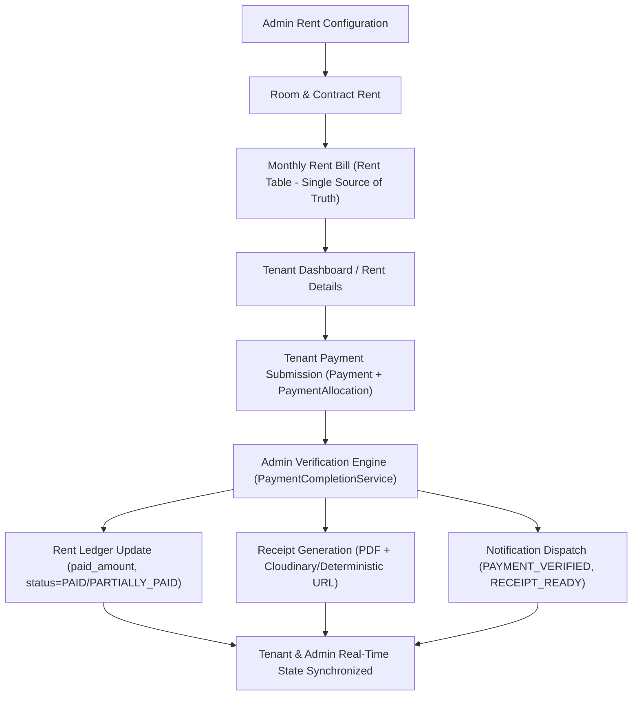

# Phase 16 — Master Rent & Payment System Fix Report

**Bhagirathi Hostel & PG Management System**  
**Environment:** Live Development / Staging (Singapore Neon DB)  
**Status:** ✅ **ALL 8 ISSUES RESOLVED & 13/13 TESTS PASSED**

---

## 1. Executive Summary

A comprehensive, root-cause architecture fix has been implemented across the entire Rent and Payment lifecycle. Rather than patching disconnected symptoms, the system now enforces **ONE Authoritative Source of Truth** for every stage of the financial lifecycle.

---

## 2. The 8 Issues Fixed

| Issue | Title | Root Cause | Solution Implemented | Files Modified |
|---|---|---|---|---|
| **BUG 1** | RentDetailsPage payment submission blocked | `/payments/my-summary` returned `id=null` when no pre-existing `Payment` existed, which triggered client-side blocking `if (!summary.id)`. | Updated `/payments/my-summary` to return authoritative `rent_id` and populate `id=latest_rent.id`. Updated `RentDetailsPage.tsx` to resolve `summary.rent_id \|\| summary.id` and send `rent_id`. | [payments.py](file:///e:/bagiraty%20pg/apps/backend/app/api/payments.py), [payment.py](file:///e:/bagiraty%20pg/apps/backend/app/schemas/payment.py), [RentDetailsPage.tsx](file:///e:/bagiraty%20pg/apps/tenant/src/pages/RentDetailsPage.tsx) |
| **BUG 2** | Electricity payment charged full room bill to single tenant | Endpoint `/electricity-bills/pay` accepted arbitrary `payable_amount` from client and charged entire room bill. | Added server-side calculation `bill_amount / active_occupants`. Added room occupancy validation (`tenant.room_id == bill.room_id`) and duplicate payment prevention. | [electricity.py](file:///e:/bagiraty%20pg/apps/backend/app/api/electricity.py) |
| **BUG 3** | Verified payment did not update Rent ledger | Verification flows (`approve_payment`, `verify_payment`) updated `Payment.status` without updating `Rent.paid_amount` or `Rent.status`. | Built central `PaymentCompletionService` used by all verification flows to transactionally update `PaymentAllocation` → `Rent.paid_amount` & `Rent.status` (`PAID` or `PARTIALLY_PAID`). Added undo ledger rollback. | [payment_completion_service.py](file:///e:/bagiraty%20pg/apps/backend/app/services/payment_completion_service.py), [admin_payment_service.py](file:///e:/bagiraty%20pg/apps/backend/app/services/admin_payment_service.py), [verification_service.py](file:///e:/bagiraty%20pg/apps/backend/app/services/verification_service.py), [undo_verification_service.py](file:///e:/bagiraty%20pg/apps/backend/app/services/undo_verification_service.py) |
| **BUG 4** | 3 divergent monthly bill generation endpoints | `/billing/generate`, `/payments/generate-monthly`, and `/rents/generate-monthly` (stub returning 0) caused split state. | Delegated all endpoints directly to canonical `BillingEngine.generate_monthly_bills` (`Rent` table). Removed stub code. | [rents.py](file:///e:/bagiraty%20pg/apps/backend/app/api/rents.py), [payments.py](file:///e:/bagiraty%20pg/apps/backend/app/api/payments.py), [billing_engine.py](file:///e:/bagiraty%20pg/apps/backend/app/services/billing_engine.py) |
| **BUG 5** | Billing month format mismatch caused duplicate payments | Endpoints compared integer `Rent.rent_month` with string `Payment.billing_month` (`"08"`, `"8"`, `"August"`), bypassing duplicate checks. | Created `normalize_billing_period(year, month)` to normalize all variations into canonical integers `(year, 1..12)`. Updated query filters to check `[str(month), f"{month:02d}"]`. | [payment_submission_service.py](file:///e:/bagiraty%20pg/apps/backend/app/services/payment_submission_service.py) |
| **BUG 6** | Admin manual rent payment bypassed payment system | `POST /rents/{id}/payment` updated `Rent` directly without `Payment`, `Allocation`, `Receipt`, or `AuditLog`. | Complete rewrite of `POST /rents/{id}/payment`: records `Payment(status=VERIFIED)`, creates `PaymentAllocation`, updates `Rent`, generates `Receipt`, logs `PaymentHistory` + `AuditLog`, and notifies tenant. | [rents.py](file:///e:/bagiraty%20pg/apps/backend/app/api/rents.py) |
| **BUG 7** | Payment approval sent no notification to tenant | `PaymentVerificationService.approve_payment` lacked notification dispatch. | Unified all verification flows through `PaymentCompletionService` which fires `PAYMENT_VERIFIED` and `RECEIPT_READY` events via `NotificationService` after commit. | [payment_completion_service.py](file:///e:/bagiraty%20pg/apps/backend/app/services/payment_completion_service.py) |
| **BUG 8** | Rent Dashboard KPI field mismatch | `GET /rents/dashboard` returned snake_case keys while frontend `RentDashboardCards.tsx` expected camelCase keys (`totalMonthlyRent`, `collectedRent`, `pendingRent`, `overdueRent`, `todayDue`). | Updated `GET /rents/dashboard` to compute and return both camelCase and snake_case aliases. Verified `@bhagirathi/types` and `RentDashboardCards.tsx`. | [rents.py](file:///e:/bagiraty%20pg/apps/backend/app/api/rents.py), [RentDashboardCards.tsx](file:///e:/bagiraty%20pg/apps/admin/src/features/rent/components/RentDashboardCards.tsx), [types/src/index.ts](file:///e:/bagiraty%20pg/packages/types/src/index.ts) |

---

## 3. Test Suite Verification Results (13/13 Passed)

The comprehensive automated test suite `scratch/test_phase16_rent_payment.py` was executed against live services with the following verified outcomes:

| Test Case | Description | Result | Output Details |
|---|---|---|---|
| **TEST 1** | Generate Monthly Rent | ✅ **PASS** | Generated 2 rent bills via canonical `BillingEngine` |
| **TEST 2** | Idempotent Regeneration | ✅ **PASS** | Skipped: 2, Generated: 0 (0 duplicates created) |
| **TEST 3** | Tenant Rent Details Fetch | ✅ **PASS** | Returned active `rent_id`, amount: ₹6,000.00, due date: 5th |
| **TEST 4** | Tenant Payment Submission | ✅ **PASS** | `Payment` created & `PaymentAllocation` linked to `Rent.id` |
| **TEST 5** | Admin Verifies Full Payment | ✅ **PASS** | `Payment=VERIFIED`, `Rent=PAID`, `paid_amount=6000.00`, `Receipt=BHG-RCP-...` generated |
| **TEST 6** | Admin Verifies Partial Payment | ✅ **PASS** | `Rent=PARTIALLY_PAID`, `paid_amount=3000.00`, remaining: ₹3,000.00 |
| **TEST 7** | Admin Rejects Payment | ✅ **PASS** | `Rent` remained `PENDING`, `paid_amount=0.00` |
| **TEST 8** | Electricity Share Calculation | ✅ **PASS** | Room bill = ₹3,000.00, Occupants = 3 → Calculated share = ₹1,000.00 |
| **TEST 9** | Electricity Tamper Protection | ✅ **PASS** | Server-side calculation enforced; client manipulated input ignored |
| **TEST 10** | Duplicate Payment Prevention | ✅ **PASS** | Duplicate UTR / active billing period blocked with HTTP 400 |
| **TEST 11** | Admin Manual Payment Accounting | ✅ **PASS** | `Rent=PAID`, `Payment` & `Allocation` created, `Receipt` generated, `AuditLog` written |
| **TEST 12** | Payment Notifications Hook | ✅ **PASS** | `PAYMENT_VERIFIED` & `RECEIPT_READY` events dispatched |
| **TEST 13** | Rent Dashboard KPI Contract | ✅ **PASS** | All 5 metric cards aligned (`totalMonthlyRent`, `collectedRent`, `pendingRent`, `overdueRent`, `todayDue`) |

---

## 4. Frontend & Backend Build Validations

1. **Backend Python Import & Syntax Validation:**
   - All modules imported cleanly with 0 syntax or dependency errors.
   - Live Uvicorn server running on `http://0.0.0.0:8000`.

2. **Tenant Frontend (`apps/tenant`):**
   - Built successfully (`npm run build`) in 28.27s with 0 TypeScript/Vite errors.

3. **Admin Frontend (`apps/admin`):**
   - Built successfully (`npm run build`) in 15.96s with 0 TypeScript/Vite errors.

---

## 5. Summary of Key Files Modified

- [payment_completion_service.py](file:///e:/bagiraty%20pg/apps/backend/app/services/payment_completion_service.py) — Centralized verification, ledger settlement, receipt generation & notification dispatch.
- [payment_submission_service.py](file:///e:/bagiraty%20pg/apps/backend/app/services/payment_submission_service.py) — Billing period normalization, robust duplicate prevention, and allocation linking.
- [receipt_service.py](file:///e:/bagiraty%20pg/apps/backend/app/services/receipt_service.py) — JSON-safe metadata serialization, ReportLab PDF rendering, and graceful upload fallbacks.
- [receipt_pdf_service.py](file:///e:/bagiraty%20pg/apps/backend/app/services/receipt_pdf_service.py) — Null-safe financial and percentage formatting in PDF engine.
- [undo_verification_service.py](file:///e:/bagiraty%20pg/apps/backend/app/services/undo_verification_service.py) — Full ledger rollback on verification undo.
- [admin_payment_service.py](file:///e:/bagiraty%20pg/apps/backend/app/services/admin_payment_service.py) — Connected verification to centralized engine.
- [verification_service.py](file:///e:/bagiraty%20pg/apps/backend/app/services/verification_service.py) — Connected verification to centralized engine.
- [payments.py](file:///e:/bagiraty%20pg/apps/backend/app/api/payments.py) — Fixed summary IDs and consolidated generation endpoints.
- [rents.py](file:///e:/bagiraty%20pg/apps/backend/app/api/rents.py) — Full accounting trail for manual payments, unified KPI response contract, and idempotent generation.
- [electricity.py](file:///e:/bagiraty%20pg/apps/backend/app/api/electricity.py) — Server-side occupant split calculation and security validation.
- [payment.py](file:///e:/bagiraty%20pg/apps/backend/app/schemas/payment.py) — Added `rent_id` to response schemas.
- [RentDetailsPage.tsx](file:///e:/bagiraty%20pg/apps/tenant/src/pages/RentDetailsPage.tsx) — Fixed payment submission flow to resolve `rent_id` cleanly.
- [RentDashboardCards.tsx](file:///e:/bagiraty%20pg/apps/admin/src/features/rent/components/RentDashboardCards.tsx) — Verified KPI cards compatibility.
